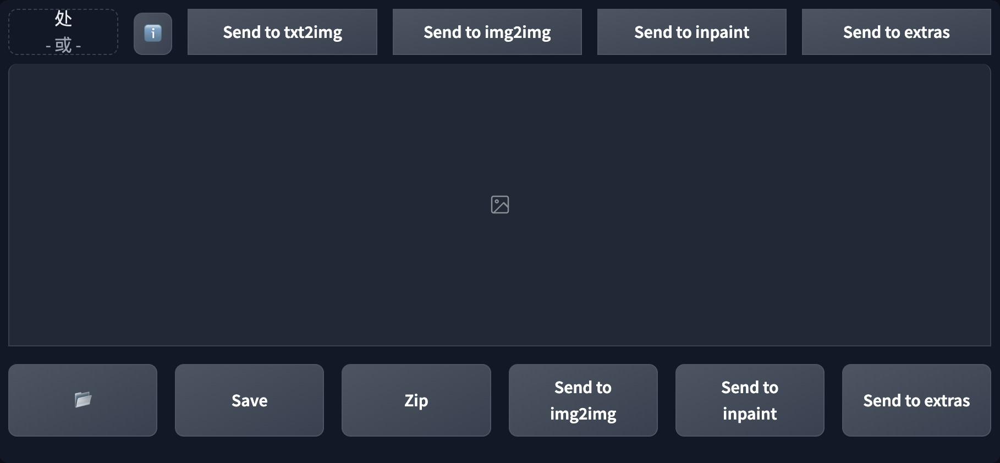

# Quick PNG Info
[[中文版]](./README_zh.md)  
Embed "PNG Info" into the txt2imga and img2img tabs, you can use it without leaving the tab    

## Screenshot
  

## Usage
The extension will add a single line "PNG Info" block above the result gallery.  
Drop the image file into the image-box in the upper left corner just like you are using original PNG Info.  
And you can press the ℹ️ button to expand or collapse the generation info text.  

## Install
1. Go to SD WebUI's `extension` tab
2. Click `Install from URL` subtab
3. Paste `https://github.com/lihaoyun6/sd-webui-Quick-PNG-Info` into the URL textbox
4. Click `Install` and wait for it to complete
5. Once completed, the WebUI needs to be reloaded

## Credits
- [Stable Diffusion web UI](https://github.com/AUTOMATIC1111/stable-diffusion-webui) @AUTOMATIC1111  
