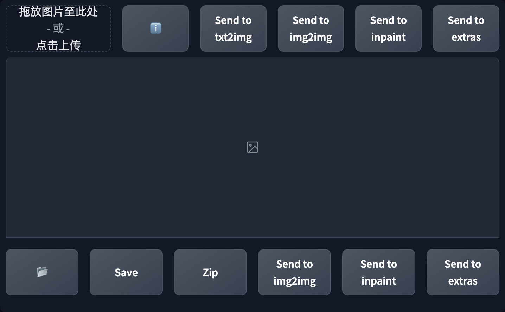

# Quick PNG Info 
在文生图和图生图界面中嵌入PNG Info功能区, 让你无需离开标签页即可导入图片信息.   

## 截图
  

## 使用说明
此插件会在文生图和图生图界面的输出图库上方添加一个单行的 PNG Info 功能区.  
将图片拖到功能区左上角的图像框中即可读取信息, 与原版 PNG Info的操作完全一样.  
点击任何一个按钮将生成信息发送到对应的标签页, 或点击 ℹ️ 按钮查看文本信息.  

## 安装
1. 前往 SD WebUI 的 `扩展` 标签页
2. 点击 `从网址安装` 子标签
3. 将 `https://github.com/lihaoyun6/sd-webui-Quick-PNG-Info` 粘贴进网址输入框
4. 点击 `安装` 并等待完成
5. 提示安装成功后重载 WebUI 即可启用

## 鸣谢
- [Stable Diffusion web UI](https://github.com/AUTOMATIC1111/stable-diffusion-webui) @AUTOMATIC1111  
